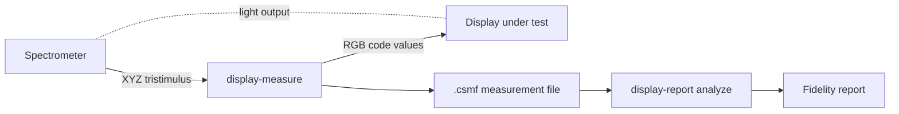

# Usage

## Where the measurements come from

display-report reports; it does not measure. Measurement sessions belong to
[display-measure](https://github.com/OpenDisplayEval/display-measure), which
drives the patches, reads the instruments, holds the session gates, and writes
the measurement file this tool reads. Reporting needs that file and nothing
else — no signal generator, no instrument, no rig.

Any `.csmf` measurement file works, whoever wrote it.



## Workflow

### 1. Analyze — `display-report analyze`

Takes stimulus-response pairs from a `.csmf` file, derives the display's native
primary matrix, computes expected colorimetric values for every sent code value,
and compares them against measured output. Generates a PDF report with:

- **dE2000 and dE ITP** colour difference between expected and measured output
- **EOTF tracking** — how closely luminance output follows the PQ curve
- **Primary matrix estimation** — the display's derived RGB primaries
- **White point stability** — CCT and Duv drift across luminance levels
- **Grey scale linearity** and colour cube accuracy
- **CIE u'v' chromaticity error** vectors with MacAdam ellipses

```bash
uv run display-report analyze path/to/measurements.csmf
```

### 2. Anonymize — `display-report anonymize`

Strips identifying metadata (device names, timestamps, notes) from measurement
files for sharing or publication.

```bash
uv run display-report anonymize path/to/measurements.csmf
```

## Python API

Public names are re-exported from the package root and resolve lazily, so
importing `display_report` costs nothing beyond the standard library:

```python
from display_report import ReflectanceData, analyze_measurements_from_file

analysis = analyze_measurements_from_file("measurements.csmf")
```

To render the report without going through the CLI — what a server serving a
download does — ask for the bytes:

```python
from display_report import analyze_measurements_from_file, render_report_pdf

pdf_bytes = render_report_pdf(analyze_measurements_from_file("measurements.csmf"))
```

No export reaches a device. Analysis is a pure function of a measurement file,
so a machine that reports needs neither the DeckLink SDK nor an instrument.

## Installation

### Prerequisites

- **Python >=3.12, <3.15**
- **[uv](https://docs.astral.sh/uv/)** — Python package manager

No device drivers. To produce measurement files, see
[display-measure](https://github.com/OpenDisplayEval/display-measure).

### Setup

```bash
git clone https://github.com/OpenDisplayEval/display-report.git
cd display-report

# Install dependencies (colour-science, colour-datasets, colour-specio from PyPI)
uv sync

# Verify installation
uv run display-report analyze --help
```

## CLI Reference

### `display-report analyze`

Compare sent code values against measured output and generate a PDF fidelity
report.

```bash
uv run display-report analyze <measurement_file.csmf> [options]
```

### `display-report anonymize`

Strip identifying metadata from measurement files.

```bash
uv run display-report anonymize <measurement_file.csmf>
```

## Project Structure

```
display-report/
├── display_report/               # Main package
│   ├── __init__.py               # Lazy public API
│   ├── cli.py                    # Subcommand dispatcher
│   ├── scripts/                  # Subcommand implementations
│   │   ├── analyze_display_measurements.py  #   display-report analyze
│   │   └── strip_metadata.py     #   display-report anonymize
│   ├── analysis.py               # Colorimetric analysis
│   ├── pdf.py                    # Report page rendering
│   ├── fonts/                    # Bundled Anuphan typeface
│   ├── device_info.py            # Structured device metadata
│   └── utilities.py              # Shared helper functions
├── tests/                        # Test suite
├── pyproject.toml                # Project config and dependencies
└── tasks.py                      # Invoke task definitions
```

## Development

All commands are run through `uv run` to use the project's virtual environment:

```bash
# Full development workflow (format, lint, typecheck, spellcheck, test)
uv run invoke dev

# Quality checks only (no tests)
uv run invoke check

# Auto-fix lint and format issues
uv run invoke check-fix

# Individual checks
uv run invoke typecheck       # Pyright type checking
uv run invoke spellcheck      # cspell spell checking
uv run invoke test            # pytest suite
```

### Guidelines

- **Type hints** on all function signatures
- **NumPy-style docstrings** for public functions and classes
- **ruff** for linting and formatting (line length 88)
- **DRY** — reuse utilities from `display_report.utilities`
- Use specific exception types; avoid bare `except`
- Let unexpected errors propagate
