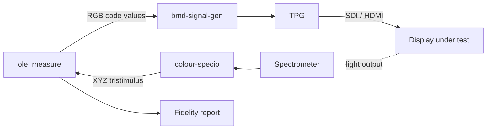

# Usage

## Hardware Setup

1. **Test PC** — runs the measurement and analysis software.

2. **Display under test** — the display being evaluated. Set to PQ / native
   gamut mode before measuring. Note the target bit depth, maximum luminance
   (nits), and HDR parameters for the measurement session.

3. **Test pattern generator** — sends PQ (ST-2084) encoded RGB code values
   directly to the display via HDMI, bypassing PC OS/GPU colour management.
   Supported devices are determined by
   [bmd-signal-gen](https://github.com/OpenLEDEval/bmd-signal-gen).

4. **Spectroradiometer** — measures the display's light output (spectral power
   distribution, XYZ tristimulus) for each test patch. Supported devices are
   determined by
   [colour-specio](https://github.com/colour-science/colour-specio).



## Workflow

### 1. Measure — `ole_measure`

Sends PQ-encoded test patches to the display via the test pattern generator
while the spectroradiometer captures XYZ tristimulus values for each patch.
Produces a `.csmf` (Colour Science Measurement File) containing all
stimulus-response pairs.

```bash
uv run ole_measure \
    --max-nits 1500 \
    --bit-depth 10 \
    --warmup 10 \
    --save-directory ./measurements \
    --tile-name "Display A — Panel 3"
```

### 2. Analyze — `ole_analyze`

Takes stimulus-response pairs from a `.csmf` file, derives the display's native
primary matrix, computes expected colorimetric values for every sent code value,
and compares them against measured output. Generates a PDF report with:

- **dE2000 and dE ITP** colour difference between expected and measured output
- **EOTF tracking** — how closely luminance output follows the PQ curve
- **Primary matrix estimation** — the display's derived RGB primaries
- **White point stability** — CCT and Duv drift across luminance levels
- **Grey scale linearity** and colour cube accuracy
- **CIE u'v' chromaticity error** vectors with MacAdam ellipses

```bash
uv run ole_analyze path/to/measurements.csmf
```

### 3. Anonymize — `ole_anonymize`

Strips identifying metadata (tile names, timestamps, notes) from measurement
files for sharing or publication.

```bash
uv run ole_anonymize path/to/measurements.csmf
```

## Installation

### Prerequisites

- **Python >=3.12, <3.15**
- **[uv](https://docs.astral.sh/uv/)** — Python package manager
- **TPG drivers** — install the drivers for your test pattern generator (see
  [bmd-signal-gen](https://github.com/OpenLEDEval/bmd-signal-gen) for supported
  hardware and setup)

### Setup

```bash
git clone https://github.com/OpenLEDEval/OLE-Toolset.git
cd OLE-Toolset

# Install dependencies (colour-science, colour-datasets, colour-specio from PyPI)
uv sync

# Verify installation
uv run ole_measure --help
```

## CLI Reference

### `ole_measure`

Send test patterns and capture spectroradiometer measurements.

| Argument               | Default  | Description                                            |
| ---------------------- | -------- | ------------------------------------------------------ |
| `--device-index`       | `0`      | TPG device index                                       |
| `--bit-depth`          | auto     | Bit depth for test colours (auto-detected from device) |
| `--max-nits`           | `1500`   | Tile maximum luminance in nits                         |
| `--min-above-black`    | `0.1`    | Minimum measurable PQ value                            |
| `--warmup`             | `10`     | Warmup time in minutes (random colour stabilization)   |
| `--stabilization-time` | `5`      | Seconds of random colours between patches              |
| `--grey-n`             | `25`     | Grey ramp sample count                                 |
| `--cube-n`             | `8`      | Colour cube samples per axis (total = n^3)             |
| `--black-n`            | `20`     | Black patch repeat count                               |
| `--white-n`            | `5`      | White patch repeat count                               |
| `--random`             | `100`    | Random test colour count                               |
| `--measurement-speed`  | `normal` | Spectrometer speed setting                             |
| `--use-virtual`        | —        | Use virtual spectrometer (for debugging)               |
| `--save-directory`     | `./`     | Output directory                                       |
| `--save-file`          | auto     | Output filename (default: timestamped)                 |
| `--tile-name`          | auto     | Metadata label embedded in output file                 |

### `ole_analyze`

Compare sent code values against measured output and generate a PDF fidelity
report.

```bash
uv run ole_analyze <measurement_file.csmf> [options]
```

### `ole_anonymize`

Strip identifying metadata from measurement files.

```bash
uv run ole_anonymize <measurement_file.csmf>
```

## Project Structure

```
OLE-Toolset/
├── ole/                          # Main package
│   ├── scripts/                  # CLI entry points
│   │   ├── measure_display.py    #   ole_measure
│   │   ├── analyze_display_measurements.py  #   ole_analyze
│   │   └── strip_metadata.py     #   ole_anonymize
│   ├── ETC/                      # Analysis and PDF report generation
│   ├── tpg_controller.py         # Test pattern generator control
│   ├── measurement_controllers.py # Spectroradiometer measurement coordination
│   ├── test_colors.py            # Test colour set generation (PQ ramps, cubes)
│   └── utilities.py              # Shared helper functions
├── tests/                        # Test suite
├── pyproject.toml                # Project config and dependencies
└── tasks.py                      # Invoke task definitions
```

## Development

All commands are run through `uv run` to use the project's virtual environment:

```bash
# Full development workflow (format, lint, typecheck, spellcheck, test)
uv run invoke dev

# Quality checks only (no tests)
uv run invoke check

# Auto-fix lint and format issues
uv run invoke check-fix

# Individual checks
uv run invoke typecheck       # Pyright type checking
uv run invoke spellcheck      # cspell spell checking
uv run invoke test            # pytest suite
```

### Guidelines

- **Type hints** on all function signatures
- **NumPy-style docstrings** for public functions and classes
- **ruff** for linting and formatting (line length 88)
- **DRY** — reuse utilities from `ole.utilities`
- Use specific exception types; avoid bare `except`
- Let unexpected errors propagate
